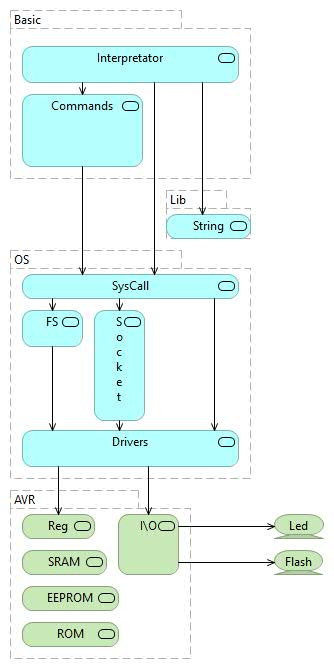

# Интерпретатор Basic TCP для Arduino

Для ввода команд и вывода результата использует COM-порт (Serial Monitor).  
Результат выводится на дисплей Nokia 5110.  
  
Также для ввода/вывода можно использовать сетевой протокол TCP.

Поддерживает команды:
- NEW
- LIST
- RUN

Операторы Basic:
- PRINT
- INPUT
- IF
- GOTO
- +,-,*,/
- =

Переменные (26 штук): A-Z

Максимальное количество строк в программе: 10 (ограничено, потому что у ATmega328P SRAM-память: 2 КБ) 
Максимальная длина строки программы: 20 символов  
Не сохраняет программу в постоянную память.  

- Версия для Arduino
- Написан на языке C++

Статус проекта: Разрабатывается.

Copyright (c) 2022 Evgeny Goryachev  
Gor.Com 